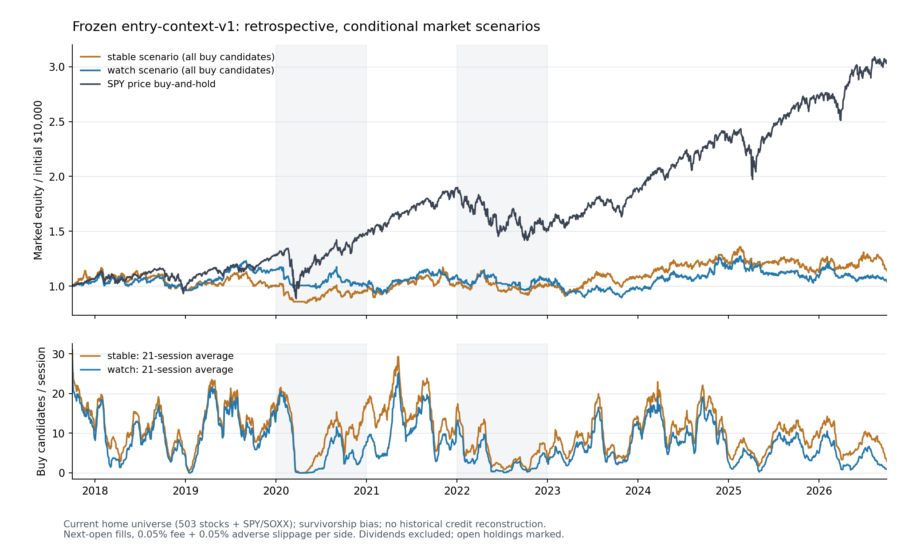

# 매수 TOP 조건 과거 검증 — 2026-10-04

현행 조건을 바꾸지 않고 **2017-10-02–2026-10-02, 2,263거래일, 현재 홈 대상 505개**를 검증했다. 매수 후보가 0개였던 날은 stable 가정에서 **9.15%**, watch 가정에서 **18.91%**였다.

이것은 가격 조건의 **조건부·탐색적** 백테스트다. 당시 시장 위험 피드를 재구성한 전체 서비스의 과거 실적은 아니다. 현재 구성 종목만 사용하므로 생존 편향이 있으며, 과거 규칙 설계 후 시행한 연구라 미관측 검증도 아니다.

고정 실행 모형의 계좌 CAGR은 stable **1.51%**, watch **0.47%**로 SPY 가격 보유 **13.21%**보다 낮았다. 매수 TOP 3의 20·63일 표본 평균 초과수익도 두 가정 모두 음수였다. 매수 0개 자체는 오류의 증거가 아니지만, 이번 실험에서 현행 조합의 성과 우위는 확인되지 않았다.

## 매수 TOP은 얼마나 자주 비었나

| 지표 | 항상 stable 가정 | 항상 watch 가정 |
| --- | ---: | ---: |
| 후보 0개 거래일 | 207 | 428 |
| 후보 1개 거래일 | 136 | 220 |
| 후보 2개 거래일 | 130 | 186 |
| 후보 3개 이상 거래일 | 1,790 | 1,429 |
| 하루 평균 buy 수 | 10.39 | 7.56 |
| 반복 포함 신호 관측 | 23,523 | 17,103 |
| 비매수→매수 신호 시작 횟수 | 17,944 | 12,883 |

동일 종목의 연속 신호는 별도 날짜로 센다. 신호 시작 횟수도 계좌 거래 수나 독립 표본 수를 뜻하지 않는다.

| 연도 | 거래일 | stable 0개 일수 | watch 0개 일수 | stable 하루 평균 buy | watch 하루 평균 buy |
| --- | ---: | ---: | ---: | ---: | ---: |
| 2017 | 63 | 0 | 0 | 16.27 | 14.43 |
| 2018 | 251 | 23 | 38 | 10.05 | 7.99 |
| 2019 | 252 | 13 | 24 | 13.44 | 11.66 |
| 2020 | 253 | 60 | 97 | 9.57 | 5.78 |
| 2021 | 252 | 7 | 19 | 15.90 | 10.93 |
| 2022 | 251 | 64 | 114 | 4.48 | 2.54 |
| 2023 | 250 | 14 | 36 | 8.59 | 6.35 |
| 2024 | 252 | 6 | 11 | 13.60 | 10.87 |
| 2025 | 250 | 13 | 41 | 8.00 | 5.24 |
| 2026 | 189 | 7 | 48 | 7.73 | 4.02 |

2017년은 10월부터, 2026년은 10월 2일까지다.

## 현재 빈 매수 목록의 재현

고정한 홈 원본(가격 생성 2026-10-04T01:27:08+00:00, 시장 생성 2026-10-04T10:44:58.655328+00:00)과 다운로드 이력으로 다시 계산한 **505개 판정·점수가 모두 일치**했다. 실제 해당 시장 피드의 상태는 `stable`이고 `buy=0`다.

```json
{"avoid": 153, "breakout": 16, "confirm": 10, "overextended": 15, "pullback": 51, "riskwait": 19, "watch": 241}
```

빈 매수 목록은 과거에도 관측되는 규칙 결과다. 빈도만으로 55일/8% 기준의 최적성이나 수익성을 판단할 수는 없다.

## 매수 TOP 3의 후속 가격 성과

매일 기존 점수·ticker 순서로 최대 3개를 선택했다. 다음 실제 거래일 시가 진입 후 20·63번째 보유 거래일 종가 청산에 양쪽 비용을 반영했다. 동일 날짜·기간 SPY와 비교한다. **손절 실행·복리 계좌 성과가 아닌 고정기간 관찰 통계**다.

| 가정 / 보유기간 | 성숙 관측 | 평균 순수익률 | 중앙값 | 수익 양수 비율 | 동기간 SPY 평균 | 평균 초과수익 | 평균 최저가 변동 |
| --- | ---: | ---: | ---: | ---: | ---: | ---: | ---: |
| stable / 20일 | 5,728 | 0.17% | 0.36% | 52.55% | 0.55% | -0.39%p | -5.91% |
| stable / 63일 | 5,604 | 2.30% | 1.61% | 55.35% | 2.53% | -0.23%p | -10.41% |
| watch / 20일 | 4,863 | 0.02% | 0.33% | 52.48% | 0.37% | -0.35%p | -5.27% |
| watch / 63일 | 4,786 | 1.41% | 1.48% | 55.33% | 2.16% | -0.75%p | -9.53% |

초과수익은 퍼센트포인트다. 최저가 변동은 진입 시가 대비 비용 전의 보유기간 최저 저가이며 계좌 최대낙폭이 아니다. 미성숙·결측 제외 수, 날짜별 균등 가중 평균, 하위 10%와 전체 buy 결과는 `results.json`에 있다. 중첩 기간·같은 날짜 종목의 상관 때문에 위 표본 수를 독립적인 성공 횟수로 보지 않는다.

## 기존 실행 규칙을 적용한 가상 계좌

각 가정은 $10,000으로 시작하며 **TOP 3으로 제한하지 않고 전체 buy를 점수순으로 주문**한다. 거래당 계좌 위험 1%, 최대 5종목, 진입 비중 최대 20%, 동일 현재 업종 최대 2개, 정수 주식·현금 계좌다. 양쪽 수수료와 불리한 슬리피지는 각각 0.05%. 다음 시가 체결, 0.5변동폭 초과 갭 취소, 같은 봉에서는 손절 우선. 돌파는 목표가 없이 추적 손절, 눌림목은 신호 전 55일 고점을 목표로 한다. 보유 reduce와 손절 상향은 다음 봉부터 적용한다. 자세한 규칙은 [PROTOCOL.md](PROTOCOL.md)에 고정했다.

| 지표 | stable 가정 | watch 가정 | SPY 가격 보유 |
| --- | ---: | ---: | ---: |
| 종료 청산 비용 포함 총수익률 | 14.45% | 4.30% | 205.42% |
| CAGR | 1.51% | 0.47% | 13.21% |
| 일별 종가 최대낙폭 | 27.51% | 27.28% | 34.10% |
| 평균 투자 노출 | 82.58% | 84.39% | 약 100% |
| 진입 / 청산 거래 | 429 / 425 | 383 / 380 | 1 / 1 |
| 청산 거래 순이익 승률 | 28.71% | 29.21% | — |
| 종료 시 보유 포지션 | 4 | 3 | — |

종료 청산 비용은 미청산 포지션을 마지막 종가로 매도한다고 가정한 비용까지 차감했다. 청산 거래 수·승률에는 이 가상 마지막 매도를 넣지 않는다. 그래프·연별 성적은 실제 가상 운용의 종가 평가액이다. 최대낙폭은 일별 종가 기준이며 장중 최대 손실과 다르다.



| 연도 | stable 계좌 | watch 계좌 | SPY 가격 보유 | stable 연중 최대낙폭 | watch 연중 최대낙폭 |
| --- | ---: | ---: | ---: | ---: | ---: |
| 2017 | 6.36% | 3.57% | 6.01% | 7.63% | 2.39% |
| 2018 | -9.80% | -7.19% | -6.35% | 17.77% | 13.44% |
| 2019 | 3.89% | 19.36% | 28.79% | 13.18% | 9.30% |
| 2020 | -3.44% | -12.01% | 16.16% | 17.37% | 16.58% |
| 2021 | 7.26% | 9.00% | 27.04% | 14.93% | 11.25% |
| 2022 | -2.89% | -4.44% | -19.48% | 19.36% | 16.08% |
| 2023 | 8.57% | -5.72% | 24.29% | 12.55% | 16.30% |
| 2024 | 10.89% | 16.69% | 23.30% | 6.61% | 8.38% |
| 2025 | -6.75% | -6.93% | 16.35% | 18.22% | 19.25% |
| 2026 | 1.76% | -3.05% | 12.86% | 12.93% | 14.00% |

## 매수가 0개일 때의 진입 대기 TOP 3

기존 whitelist인 breakout·pullback·riskwait만, 실제 buy가 0개인 날짜에서 관찰했다. 서로 다른 날짜 집합이므로 매수 TOP과의 수익률 차이는 조건 완화의 인과적 효과가 아니다. 대기 상태를 매수 추천으로 승격하지 않는다.

| 가정 / 보유기간 | 성숙 관측 | 평균 순수익률 | 동기간 SPY | 평균 초과수익 |
| --- | ---: | ---: | ---: | ---: |
| stable / 20일 | 610 | 3.20% | 2.85% | 0.35%p |
| stable / 63일 | 610 | 10.84% | 7.93% | 2.92%p |
| watch / 20일 | 1,249 | 2.31% | 2.61% | -0.30%p |
| watch / 63일 | 1,219 | 8.98% | 6.81% | 2.17%p |

## 데이터·검증 범위와 한계

- 수집 505/505개, 유효 OHLC 1,232,165개. 공급자 접근/속도 차단·수집 실패 없음. 유효하지 않은 봉 {"FISV": ["2025-11-12"], "HUBB": ["2021-05-05"]}은 보간하지 않았다.
- 보유 중 가격 결측으로 실행·평가가 동결된 종목-거래일: stable 0, watch 0.
- 현재 구성·현재 업종을 과거에 적용했다. 당시 S&P 500 구성 변화·상장폐지·과거 업종은 재현하지 못했다.
- 과거 발표 시점의 NFCI·STLFSI4·DRTSCILM·FUNDING 피드를 확보하지 않았다. 최신 수정된 FRED 관측을 과거의 알려진 정보로 대체하지 않았다. [FRED 실시간 기간 설명](https://fred.stlouisfed.org/docs/api/fred/realtime_period.html)에 따르면 현재 알려진 과거값과 당시 알려진 값은 구분해야 한다.
- Yahoo quote OHLC를 같은 기준으로 사용했고 AdjClose와 섞지 않았다. 공급자의 수정·분할 조정이 가능하며 당시 원 시세·주식 수·기업행위를 완전히 복원한 계좌는 아니다. 배당·세금·환율은 양쪽 모두 제외했다.
- 변동폭·55일/20일 수준·지표는 신호 날짜까지의 봉만 사용한다. 미래 봉 수정 불변성, 익일 체결, 손절 우선·갭·정수 주식, 위험/unknown/stale 시장 차단, 데이터 검증·성숙 라벨과 현행 ticker 동률 순서를 테스트했다.
- 각 CSV의 신호 수와 성숙/제외 수, 거래·종료 포지션·비용·평가액의 회계 일치를 추가 확인했다.
- 임계값을 탐색·최적화하지 않았고 생산 매수 조건·홈 순위·forward 관측 원장을 변경하지 않았다.

## 재현

```bash
python scripts/collect_entry_backtest.py
node --max-old-space-size=4096 scripts/backtest_entry_rules.cjs
node scripts/test_entry_backtest.cjs
python -m unittest discover -s scripts -p test_entry_backtest.py
python scripts/render_entry_backtest.py
```

보존된 `prices.json.gz`를 `research/history/entry-backtest-2026-10-04/`에 놓으면 재다운로드 없이 동일 가격 입력으로 실행할 수 있다. `sources.json`의 원본 해시·수집일과 `results.json`의 규칙/입력 해시를 대조한다. 재다운로드 해시가 달라지면 동일 가격 버전의 재현이 아니다.

그림 재생성에는 matplotlib이 필요하다. `--validate-only` 검증은 Python 표준 라이브러리만 사용한다. 현재 원본과의 일치에는 동봉한 고정 forecasts/market snapshot을 사용한다.

정규화 가격 SHA-256: `0307d3266187abea5e008fbaefd71a447d78298365ff41d2f7939516a12cf92a`

고정 규칙 SHA-256: `fd47378b360f360615b5031dccf671c0e3770bcf165689fa721319aee82db3e0`
