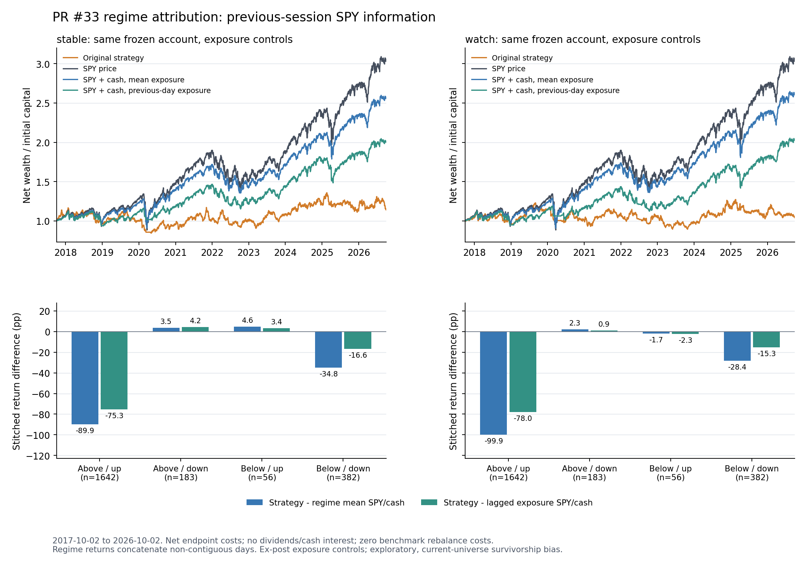

# 현행 계좌의 레짐·노출 분석 — 2026-10-04

PR #33의 **동일한 고정 가격·규칙·stable/watch 계좌**를 분해했다. 평가 기간은 2017-10-02–2026-10-02, 2,263거래일이다. 레짐별 결과를 본 뒤 생산 판정이나 임계값을 바꾸지 않았다.

**전체 성과 부진은 단순 현금 비중으로 설명되지 않는다.** 평균 투자 노출을 맞춘 SPY+현금도 두 계좌를 크게 앞섰다. 하락장 방어 여부는 아래의 하락 추세·연도별 결과와 노출 추종 benchmark를 함께 확인해야 한다.

**2022년 방어는 현금 수준만의 효과가 아니었다.** 전략은 -2.89% / -4.44%, 그해 평균 노출을 맞춘 SPY+현금은 -14.15% / -13.27%였다(stable / watch 순). 그러나 다른 하락 추세 구간과 재상승 참여까지 고려하면 일반적인 방어 필터의 우위가 확인됐다고 결론낼 수는 없다.

전 기간 일별 상승/하락 포착률은 stable 53.4% / 59.0%, watch 41.8% / 46.9%다. 두 계좌 모두 상승일 참여보다 하락일 참여가 컸다. 이 비율은 사후 날짜 집합의 일별 진단이다.

## 전 기간: 현금 수준과 노출 시점

| 가정 | 경로 | CAGR | 누적 수익률 | 종가 최대낙폭 | SPY 목표 비중 |
| --- | --- | ---: | ---: | ---: | ---: |
| stable | 원 전략 | 1.51% | 14.45% | 27.51% | 82.58% |
| stable | SPY 가격 보유 | 13.21% | 205.42% | 34.10% | 100.00% |
| stable | 평균 노출 고정 SPY+현금 | 11.07% | 157.28% | 28.82% | 82.58% |
| stable | 전날 노출 추종 SPY+현금 | 8.08% | 101.19% | 21.41% | 82.55% |
| watch | 원 전략 | 0.47% | 4.30% | 27.28% | 84.39% |
| watch | SPY 가격 보유 | 13.21% | 205.42% | 34.10% | 100.00% |
| watch | 평균 노출 고정 SPY+현금 | 11.30% | 162.04% | 29.39% | 84.39% |
| watch | 전날 노출 추종 SPY+현금 | 8.20% | 103.33% | 21.67% | 84.37% |

원 전략의 비중은 평균 **종가** 노출, 노출 추종의 비중은 평균 **직전 종가** 목표다. 현금 이자는 0이며 SPY 배당을 제외한다. 누적 수익률·CAGR은 원 연구와 같은 마지막 가상 청산 비용까지 포함한다.

SPY+현금은 분수 주식으로 매일 비중을 맞추는 **사후 통제용 합성 benchmark**다. 중간 리밸런싱 비용은 0, 최초·최종 sleeve 거래에만 원 연구의 비용을 적용한다. 평균 비중을 실제 과거 매매에 사용할 수 있었다고 주장하지 않는다. 전날 노출 추종도 장중 손절/진입을 복원하지 않는다.

## 과거 정보만 사용하는 레짐

수익 발생일의 **직전 SPY 거래일 종가까지** SMA200, 63거래일 가격 추세, 63개 로그수익률의 표본 표준편차×√252를 계산한다. 변동성 경계는 15%·25%로 고정했고 전체 표본 분위수나 결과 최적화를 사용하지 않았다. SMA200과 같은 종가는 위, 63일 추세가 0이면 하락·보합으로 분류한다.

### 200일선 × 63일 추세

아래의 수익률은 **해당 날짜들만 시간순으로 이어 붙인 복리 수익률**이다. 독립 계좌나 연속 보유 수익률이 아니다. 구간 평균 비중 benchmark는 해당 날짜의 평균 종가 노출을 맞춘다. 구간 밖 손익을 포함하거나 경계에서 새로 매매하지 않는다.

| 레짐 | 가정 | 거래일 | 평균 노출 | 전략 | SPY | 구간 평균 SPY+현금 | 전날 노출 SPY+현금 | 전략−평균비중 |
| --- | --- | ---: | ---: | ---: | ---: | ---: | ---: | ---: |
| 200일선 위 · 63일 상승 | stable | 1642 | 87.73% | 18.80% | 129.71% | 108.70% | 94.13% | -89.89%p |
| 200일선 위 · 63일 상승 | watch | 1642 | 92.08% | 16.09% | 129.71% | 115.96% | 94.10% | -99.87%p |
| 200일선 위 · 63일 하락·보합 | stable | 183 | 80.09% | -6.30% | -12.29% | -9.81% | -10.55% | +3.51%p |
| 200일선 위 · 63일 하락·보합 | watch | 183 | 81.62% | -7.72% | -12.29% | -10.00% | -8.66% | +2.28%p |
| 200일선 아래 · 63일 상승 | stable | 56 | 74.70% | 2.32% | -3.22% | -2.32% | -1.06% | +4.65%p |
| 200일선 아래 · 63일 상승 | watch | 56 | 78.35% | -4.17% | -3.22% | -2.45% | -1.91% | -1.72%p |
| 200일선 아래 · 63일 하락·보합 | stable | 382 | 62.76% | 0.48% | 56.63% | 35.26% | 17.09% | -34.78%p |
| 200일선 아래 · 63일 하락·보합 | watch | 382 | 53.55% | 1.60% | 56.63% | 29.96% | 16.92% | -28.35%p |

‘200일선 아래·63일 하락’의 382거래일에도 SPY의 날짜 연결 수익률은 56.63%였다. **과거 추세가 하락이라는 레짐은 다음 날도 하락한다는 뜻이 아니다.** 후행 필터가 여전히 하락 상태인 급반등 날짜가 포함된다. 이 구간에서 작은 일별 하락 포착률만 보고 방어 성과를 좋다고 평가하면 놓친 회복 수익을 빠뜨리게 된다.

### 낙폭과 상승·하락 포착

| 레짐 | 가정 | episode 수 | 전략 합성 낙폭 | 전략 연속 episode 낙폭 | SPY 합성 낙폭 | 상승일 / 하락일 | 전략 상승 포착 | 전략 하락 포착 |
| --- | --- | ---: | ---: | ---: | ---: | ---: | ---: | ---: |
| 200일선 위 · 63일 상승 | stable | 44 | 25.10% | 16.14% | 17.27% | 918 / 721 | 72.8% | 82.2% |
| 200일선 위 · 63일 상승 | watch | 44 | 23.22% | 14.76% | 17.27% | 918 / 721 | 60.0% | 67.4% |
| 200일선 위 · 63일 하락·보합 | stable | 53 | 11.92% | 7.08% | 16.67% | 100 / 83 | 41.4% | 42.8% |
| 200일선 위 · 63일 하락·보합 | watch | 53 | 13.10% | 7.55% | 16.67% | 100 / 83 | 34.4% | 38.7% |
| 200일선 아래 · 63일 상승 | stable | 12 | 7.44% | 5.16% | 18.64% | 30 / 25 | 45.9% | 34.5% |
| 200일선 아래 · 63일 상승 | watch | 12 | 11.12% | 5.90% | 18.64% | 30 / 25 | 32.0% | 41.5% |
| 200일선 아래 · 63일 하락·보합 | stable | 29 | 17.19% | 17.19% | 26.29% | 197 / 185 | 22.8% | 26.9% |
| 200일선 아래 · 63일 하락·보합 | watch | 29 | 13.11% | 12.72% | 26.29% | 197 / 185 | 12.5% | 14.2% |

포착률은 비용 전 SPY가 오른/내린 **일별** 날짜 집합에서 비용 포함 일수익률의 기하평균 비율이다. 월별 포착률과 다르다. 하락 포착률이 작으면 손실 참여가 작고, 음수이면 해당 하락일 집합의 전략 기하평균 수익률이 양수다. 시장이 하락 추세여도 그 안의 상승일에는 별도로 상승 포착률을 계산한다.

### 실현 변동성

| 레짐 | 가정 | 거래일 | 평균 노출 | 전략 | SPY | 구간 평균 SPY+현금 | 전략−평균비중 | 전략 합성 낙폭 | 상승 포착 | 하락 포착 |
| --- | --- | ---: | ---: | ---: | ---: | ---: | ---: | ---: | ---: | ---: |
| 변동성 <15% | stable | 1265 | 88.71% | -6.89% | 59.27% | 51.78% | -58.67%p | 26.42% | 70.7% | 81.8% |
| 변동성 <15% | watch | 1265 | 90.67% | 6.54% | 59.27% | 53.07% | -46.53%p | 17.32% | 56.7% | 62.1% |
| 변동성 15–25% | stable | 737 | 79.64% | 15.71% | 28.53% | 23.30% | -7.59%p | 19.07% | 50.1% | 49.5% |
| 변동성 15–25% | watch | 737 | 84.28% | 4.50% | 28.53% | 24.53% | -20.03%p | 19.14% | 41.8% | 43.8% |
| 변동성 ≥25% | stable | 261 | 61.13% | 6.23% | 49.20% | 29.46% | -23.23%p | 9.72% | 23.9% | 26.5% |
| 변동성 ≥25% | watch | 261 | 54.26% | -6.32% | 49.20% | 26.03% | -32.35%p | 11.84% | 11.6% | 18.7% |

개별 SMA200·63일 추세 축과 세 축의 **12구간**은 `metrics.csv`와 `results.json`에 전부 기록했다. 0거래일 구간은 null이며 적은 거래일/episode 구간을 확증으로 해석하지 않는다.

## 연별 노출 일치 비교

| 연도 | 가정 | 평균 노출 | 전략 | SPY | 연도 평균 SPY+현금 | 전날 노출 SPY+현금 | 전략−평균비중 | 전략−전날노출 |
| --- | --- | ---: | ---: | ---: | ---: | ---: | ---: | ---: |
| 2017 | stable | 94.03% | 6.36% | 6.01% | 5.64% | 5.05% | +0.72%p | +1.31%p |
| 2017 | watch | 95.19% | 3.57% | 6.01% | 5.71% | 5.06% | -2.14%p | -1.49%p |
| 2018 | stable | 87.23% | -9.80% | -6.35% | -5.41% | -10.57% | -4.39%p | +0.78%p |
| 2018 | watch | 89.39% | -7.19% | -6.35% | -5.56% | -9.58% | -1.63%p | +2.38%p |
| 2019 | stable | 85.34% | 3.89% | 28.79% | 24.22% | 18.56% | -20.33%p | -14.67%p |
| 2019 | watch | 89.06% | 19.36% | 28.79% | 25.37% | 20.02% | -6.01%p | -0.66%p |
| 2020 | stable | 62.64% | -3.44% | 16.16% | 11.32% | 6.81% | -14.75%p | -10.25%p |
| 2020 | watch | 64.07% | -12.01% | 16.16% | 11.53% | 2.99% | -23.55%p | -15.00%p |
| 2021 | stable | 87.38% | 7.26% | 27.04% | 23.38% | 22.59% | -16.12%p | -15.34%p |
| 2021 | watch | 91.65% | 9.00% | 27.04% | 24.60% | 21.62% | -15.61%p | -12.62%p |
| 2022 | stable | 73.08% | -2.89% | -19.48% | -14.15% | -15.93% | +11.26%p | +13.04%p |
| 2022 | watch | 68.60% | -4.44% | -19.48% | -13.27% | -18.26% | +8.83%p | +13.82%p |
| 2023 | stable | 86.10% | 8.57% | 24.29% | 20.71% | 17.82% | -12.14%p | -9.25%p |
| 2023 | watch | 85.25% | -5.72% | 24.29% | 20.49% | 17.01% | -26.21%p | -22.73%p |
| 2024 | stable | 92.15% | 10.89% | 23.30% | 21.36% | 21.36% | -10.47%p | -10.47%p |
| 2024 | watch | 94.68% | 16.69% | 23.30% | 21.99% | 20.72% | -5.30%p | -4.03%p |
| 2025 | stable | 83.29% | -6.75% | 16.35% | 13.74% | 5.65% | -20.49%p | -12.40%p |
| 2025 | watch | 89.20% | -6.93% | 16.35% | 14.67% | 9.16% | -21.60%p | -16.09%p |
| 2026 | stable | 83.41% | 1.69% | 12.75% | 10.63% | 8.61% | -8.94%p | -6.92%p |
| 2026 | watch | 85.23% | -3.11% | 12.75% | 10.86% | 12.97% | -13.97%p | -16.08%p |

2017년·2026년은 부분 연도다. 2026년만 마지막 가상 청산 비용을 포함하므로 기존 연별 종가 평가 표보다 조금 낮다. 다른 연도는 원 연구 수익률과 일치한다.

## 효과 분리의 범위

구간 평균 비중 SPY+현금과 SPY의 차이는 현금 **수준** 진단, 전날 노출 추종과 구간 평균 비중의 차이는 노출 **시점** 진단이다. 전략과 노출 추종의 차이에는 종목 선택·업종/beta·진입·손절·청산·실제 비용·장중 노출 차이가 함께 남는다. 이를 종목 선택만의 alpha 또는 각각의 인과 효과로 부르지 않는다.

`results.json`에는 이 세 단계의 **로그수익 차이(%p)**가 정확히 합산되어 전략−SPY와 일치하는 귀속도 남겼다. 원 수익률 차이(%p)와 로그수익 차이(%p)를 섞지 않는다.

전체 평균비중 비교와 2022년 한 해의 방어는 별개다. 방어 용도에는 다른 하락 episode, 재상승 시 참여·회복, 실제 필터 전환의 비용을 별도의 고정 연구에서 확인해야 한다. 이번에는 레짐을 사용해 매수나 보유를 바꾸는 전략을 만들거나 우승 구간을 최적화하지 않았다.

## 재현·검증

```bash
python scripts/analyze_entry_regimes.py
python -m unittest discover -s scripts -p test_entry_regimes.py
python scripts/analyze_entry_regimes.py --validate-only
```

고정 SPY 추출본·기존 계좌 곡선이 저장소에 있으므로 **재다운로드 없이** 재현한다. 원 가격 번들에서 추출 출처를 다시 검증하려면:

```bash
python scripts/analyze_entry_regimes.py --input research/history/entry-backtest-2026-10-04/prices.json.gz
```

출력은 이 research 폴더에만 쓴다. 입력·기존 결과/규칙/곡선·분석 코드·프로토콜 해시, 2×2,263개의 일별 수익/레짐/전날 노출, 모든 benchmark의 구간 성과를 보존했다. 미래/당일 가격 변경 불변성, 정확한 lookback, 경계·빈 구간, 비용·포착률, 낙폭 episode, 현금/노출 분해·복리 합산 및 원 CAGR·연별 수익/최대낙폭 일치를 검증한다.



정의는 [PROTOCOL.md](PROTOCOL.md), 전체 지표는 [metrics.csv](metrics.csv), 일별 원장은 [daily.csv](daily.csv)다. 이 요청 후에 정의된 사후 연구이고 생존 편향, 현재 업종·수정/분할 조정 가격, 배당 제외, 당시 실제 신용 상태 미복원이라는 원 연구의 제약을 그대로 승계한다. 매수 TOP·production threshold·forward 계좌는 변경하지 않았다.
