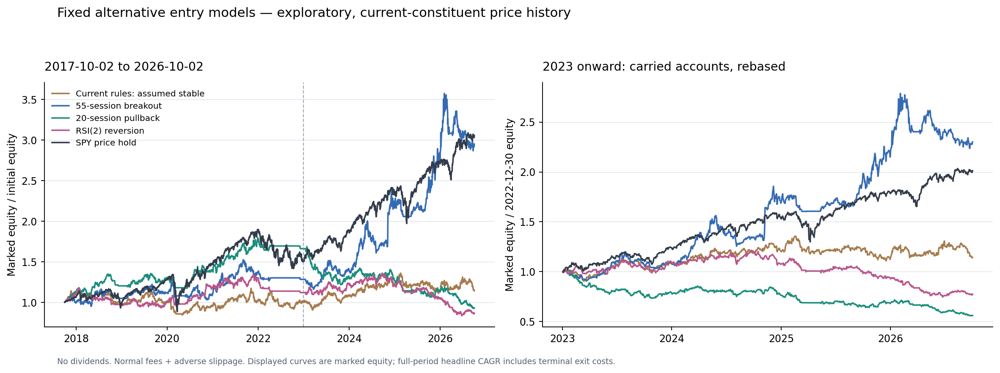

# 고정 대체 진입 전략: 과거 비교

세 대체 모델을 계산 전에 고정하고 앞선 현재 규칙 연구와 비교했다. 실시간 매수 판정과 홈페이지는 변경하지 않았다.

동일 가격 버전: **2017-10-02~2026-10-02**, **505개**, **2,263거래일**. 정상 비용은 편도 수수료 0.05%와 불리한 슬리피지 0.05%, 익일 시가 체결이다. 전체 후보 순위로 최대 5개를 보유하며 거래당 위험 1%·종목 비중 20%·동일 업종 2개를 유지했다.

## 전체 계좌 성과

계좌 성과는 전체 후보를 사용한다. 매일 TOP3만 사는 계좌가 아니다. 아래 전체 CAGR·누적 수익률은 마지막 보유분의 추가 가상 청산 비용까지 반영한다. 낙폭·평균 노출은 일별 종가 평가 기준이다.

| 모델 | 연수익률 CAGR | 누적 수익률 | 최대낙폭 | 평균 노출 | 청산 거래 | 청산 승률 |
|---|---:|---:|---:|---:|---:|---:|
| 현재 규칙 stable 가정 | 1.51% | 14.45% | 27.51% | 82.58% | 425 | 28.71% |
| 현재 규칙 watch 가정 | 0.47% | 4.30% | 27.28% | 84.39% | 380 | 29.21% |
| 55일 채널 돌파 | 12.77% | 194.91% | 23.96% | 72.33% | 414 | 33.33% |
| 20일선 눌림 반등 | -0.81% | -7.05% | 48.55% | 69.40% | 836 | 34.93% |
| RSI(2) 평균회귀 | -1.57% | -13.30% | 38.75% | 63.73% | 2765 | 57.58% |
| SPY 가격 보유 | 13.21% | 205.42% | 34.10% | 100.00% | — | — |

현재 규칙 stable/watch는 당시 실제 신용 상태를 복원하지 않은 고정 가정이다. 대체 모델은 당시 SPY 종가의 SMA200 필터를 사용하며 순위·청산도 다르다. 이 차이를 진입 조건 하나의 인과 효과로 해석할 수 없다.

돌파 계좌의 손익을 종목별로 확인하면 **WDC**의 비용 반영 손익이 **$10,836.91**, 전체 최종 순이익의 **55.60%**다. 손익 집중도는 첫 결과를 본 뒤 추가한 사후 진단이며 전략·전반 선택 규칙은 바꾸지 않았다. 20% 비중 한도는 진입 시 기준이다. 가격 상승으로 늘어난 비중을 재조정하지 않으므로 큰 추세의 이익과 위험이 한 종목에 집중될 수 있다.

## 시간 분할

아래는 같은 연속 계좌의 **종가 평가** 성과다. 보유분을 승계하고 후반 시작 자본은 2022-12-30 종가 평가액이다. 구간 끝의 추가 가상 청산 비용은 넣지 않는다. 최근 구간도 이미 가격을 본 탐색적 비교이므로 진정한 미관측 검증이 아니다.

| 모델 | 2017–2022 CAGR | 2023–2026 CAGR | 후반 SPY 대비 CAGR 차이 | 후반 최대낙폭 |
|---|---:|---:|---:|---:|
| 현재 규칙 stable 가정 | 0.05% | 3.61% | -16.86%p | 18.22% |
| 현재 규칙 watch 가정 | 0.96% | -0.20% | -20.66%p | 19.25% |
| 55일 채널 돌파 | 4.86% | 24.83% | +4.37%p | 19.77% |
| 20일선 눌림 반등 | 10.17% | -14.31% | -34.78%p | 45.18% |
| RSI(2) 평균회귀 | 2.19% | -6.57% | -27.04%p | 38.75% |
| SPY 가격 보유 | 8.30% | 20.47% | +0.00%p | 19.00% |

사전에 정한 ‘전반 CAGR 최대’ 규칙으로 선택된 대체 모델은 **20일선 눌림 반등**이다. 전반 10.17%, 후반 -14.31%다. 후반 결과로 모델·임계값을 다시 고르지 않았으며 자동 승격하지 않는다.

## 비용 2배

순위 신호를 바꾸지 않고 각 대체 계좌에서 수수료·슬리피지를 각각 2배로 높였다. 비용에 따라 수량·비용 손익비·체결 가능한 거래가 달라질 수 있다.

| 모델 | 정상 CAGR | 비용 2배 CAGR | 비용 2배 최대낙폭 | 비용 2배 후반 CAGR |
|---|---:|---:|---:|---:|
| 55일 채널 돌파 | 12.77% | 10.42% | 26.05% | 21.79% |
| 20일선 눌림 반등 | -0.81% | -4.41% | 52.37% | -15.75% |
| RSI(2) 평균회귀 | -1.57% | -11.69% | 71.26% | -17.55% |

## 후보 빈도와 TOP3 진단

TOP3 진단은 익일 시가 진입 후 20/63번째 거래일 종가의 고정 기간 수익률이다. 이는 손절·시장 필터 청산을 실행한 계좌 수익률이 아니다. 각 신호의 같은 날짜 SPY와 비교하며 모든 진단은 정상 비용을 사용한다. 일별 신호가 서로 겹치므로 독립 표본의 유의성으로 해석하지 않는다.

| 모델 | 후보 0개인 날 | 평균 후보 | 20일 TOP3 SPY 초과수익 | 성숙 표본 | 63일 TOP3 SPY 초과수익 | 성숙 표본 |
|---|---:|---:|---:|---:|---:|---:|
| 현재 규칙 stable 가정 | 9.15% | 10.39 | -0.39%p | 5,728 | -0.23%p | 5,604 |
| 현재 규칙 watch 가정 | 18.91% | 7.56 | -0.35%p | 4,863 | -0.75%p | 4,786 |
| 55일 채널 돌파 | 21.70% | 16.93 | +0.55%p | 5,080 | +1.94%p | 4,954 |
| 20일선 눌림 반등 | 19.80% | 29.23 | +0.25%p | 5,350 | +0.53%p | 5,221 |
| RSI(2) 평균회귀 | 21.52% | 21.07 | -0.22%p | 5,083 | -0.66%p | 4,954 |

미성숙·결측·분할 경계 제외 수와 시간 분할 TOP3 지표는 `results.json`에 모두 남겼다. 두 날짜를 포함한 전 구간이 한 블록 안인 표본만 분할 통계에 사용했다. 후보를 억지로 3개 채우는 모델은 없다.



## 연별 종가 평가 수익률

| 연도 | 현재 stable 가정 | 55일 돌파 | 20일선 반등 | RSI(2) | SPY 가격 |
|---|---:|---:|---:|---:|---:|
| 2017 | 6.36% | -0.82% | 12.52% | 10.88% | 6.01% |
| 2018 | -9.80% | 5.77% | 6.91% | -12.22% | -6.35% |
| 2019 | 3.89% | 6.47% | 7.37% | 3.86% | 28.79% |
| 2020 | -3.44% | -0.58% | 8.90% | 17.63% | 16.16% |
| 2021 | 7.26% | 23.92% | 26.99% | 9.45% | 27.04% |
| 2022 | -2.89% | -6.77% | -6.96% | -13.93% | -19.48% |
| 2023 | 8.57% | 10.02% | -20.41% | 9.89% | 24.29% |
| 2024 | 10.89% | 53.22% | -4.29% | -2.27% | 23.30% |
| 2025 | -6.75% | 27.53% | -10.84% | -13.31% | 16.35% |
| 2026 | 1.76% | 7.03% | -17.59% | -16.80% | 12.86% |

2017년과 2026년은 부분 연도다. 연별 수익률은 추가 경계 청산 비용을 넣지 않은 종가 평가 기준이다.

## 재현·제약

현재 구성 종목·업종을 과거에 사용하므로 생존자 편향이 있다. 상장폐지·역사적 구성 종목은 포함하지 못했다. 배당은 제외했고 공급자 수정·분할 조정 가격을 사용했다. 실제 과거 신용·펀딩 자료도 복원하지 못했다. 이 결과만으로 현재 매수 TOP을 교체하지 않는다.

입력 가격과 기존 대조군을 동봉한 재현 자료에서 실행한다:

```bash
node scripts/test_entry_strategy_comparison.cjs
node scripts/entry_strategy_comparison.cjs
python3 scripts/render_entry_strategy_comparison.py
```

전체 모델 명세는 [PROTOCOL.md](PROTOCOL.md). 코드·대조군·입력 해시와 CSV 곡선·청산 거래·미청산 포지션은 결과와 함께 보존했다.
