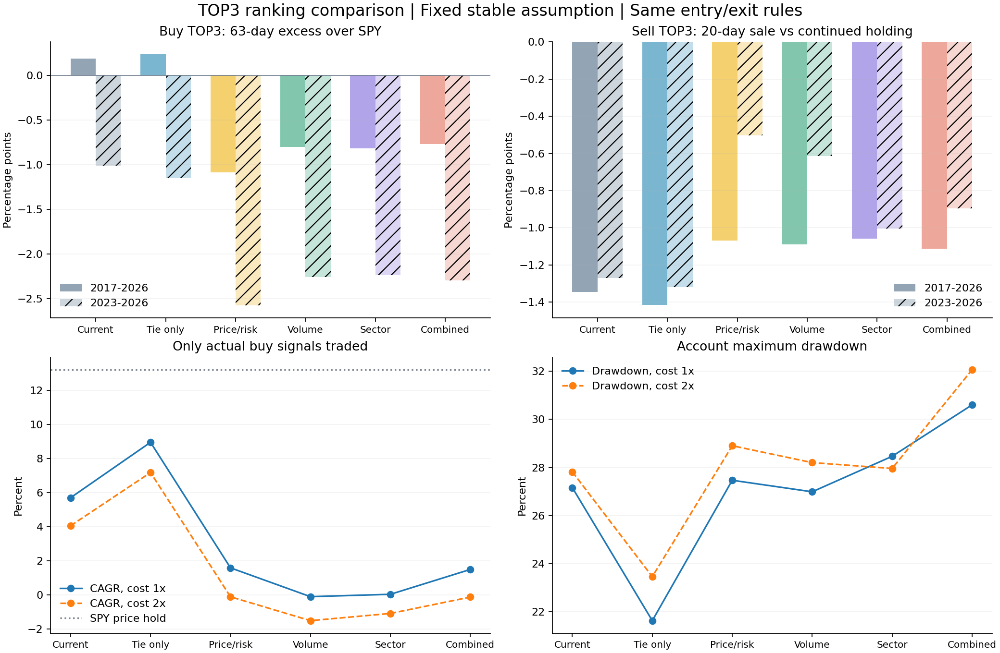

# 매수·매도 TOP3 보완 비교 — 2026-10-05

2017-10-02~2026-10-02, 2,263거래일, 현재 505개 고정 OHLC로 운영 순위와 고정 후보5개를 비교했다.
가격 SHA256은 이전 연구와 동일하다. 기존 55일 진입/보유 규칙과 운영 계좌는 변경하지 않았다.

## 매수 TOP3: 같은 날짜의 63거래일 SPY 초과수익

다음 거래일 시가 진입을 가정한 고정기간 관찰이다. **대기 후보를 포함하며 실제 매매 계좌 수익률이 아니다.**
비용은 매수/매도 각각 수수료0.05%와 불리한 슬리피지0.05%. 아래 표는 stable 가정, 날짜별 균등 평균이다.

| 방식 | 전체 초과수익 | 2020–2022 | 2023년 이후 | 기준선 대비 짝 비교 | 95% 블록 구간 |
| --- | ---: | ---: | ---: | ---: | --- |
| 기존 순위 | +0.19%p | +1.96%p | -1.01%p | 기준선 | — |
| 동점만 가격·위험 보완 | +0.23%p | +2.18%p | -1.15%p | +0.04%p | -0.17%p ~ +0.29%p |
| 가격·위험 우선 | -1.09%p | +0.51%p | -2.58%p | -1.28%p | -2.25%p ~ -0.24%p |
| 거래량 확인 추가 | -0.80%p | +0.93%p | -2.26%p | -0.99%p | -1.80%p ~ -0.26%p |
| 업종 상대 강도 추가 | -0.82%p | +0.54%p | -2.24%p | -1.00%p | -1.95%p ~ -0.10%p |
| 거래량+업종 결합 | -0.77%p | +0.95%p | -2.30%p | -0.96%p | -1.78%p ~ -0.25%p |

## 매도 TOP3: 보유 주식을 팔았을 때와 계속 보유했을 때의 차이

기존 보유 주식을 신호 다음 시가에 매도한 현금과, 같은 주식을 20번째 종가까지 보유 후 매도한 현금의 차이다.
양수는 매도가 유리, 음수는 팔아서 상승을 놓친 경우다. 공매도 수익이나 전체 하락 종목의 recall이 아니다.

| 방식 | 전체 매도 효과 | 2023년 이후 효과 | 전체 하락 적중률 | 기준선 대비 짝 비교 | 95% 블록 구간 |
| --- | ---: | ---: | ---: | ---: | --- |
| 기존 순위 | -1.35%p | -1.27%p | 44.90% | 기준선 | — |
| 동점만 가격·위험 보완 | -1.41%p | -1.32%p | 45.44% | -0.06%p | -0.28%p ~ +0.12%p |
| 가격·위험 우선 | -1.07%p | -0.50%p | 46.35% | +0.27%p | -0.31%p ~ +0.81%p |
| 거래량 확인 추가 | -1.09%p | -0.61%p | 46.53% | +0.25%p | -0.30%p ~ +0.75%p |
| 업종 상대 강도 추가 | -1.06%p | -1.00%p | 45.88% | +0.29%p | -0.34%p ~ +0.88%p |
| 거래량+업종 결합 | -1.11%p | -0.90%p | 46.08% | +0.23%p | -0.35%p ~ +0.75%p |

## 실제 buy만 거래한 보조 계좌

매일 선정된 매수 TOP3 중 실제 buy 조건을 충족한 종목만 다음 시가에 주문한다. 대기 후보는 거래하지 않는다.
위험1%, 최대5종목·종목20%·동일업종2개·정수주식, 기존 손절/청산 규칙을 동일하게 적용한다.
모든 보유 종목은 holding 판단으로 관리하며, 매도 TOP3 밖이라고 위험 대응을 생략하지 않는다.
이 계좌는 이전 PR33의 ‘전체 buy 주문’ 계좌와 대상이 다르므로 그 CAGR과 직접 대조하지 않는다.

| 방식 | CAGR | 최대낙폭 | 비용2배 CAGR | 비용2배 낙폭 | 진입 횟수 | 최대 이익 종목 / 이익 비중 |
| --- | ---: | ---: | ---: | ---: | ---: | --- |
| 기존 순위 | 5.70% | 27.16% | 4.06% | 27.82% | 409 | NRG / 33.44% |
| 동점만 가격·위험 보완 | 8.95% | 21.63% | 7.18% | 23.46% | 388 | NRG / 21.61% |
| 가격·위험 우선 | 1.59% | 27.47% | -0.11% | 28.90% | 432 | NRG / 130.32% |
| 거래량 확인 추가 | -0.10% | 26.99% | -1.50% | 28.20% | 435 | NRG / — |
| 업종 상대 강도 추가 | 0.04% | 28.46% | -1.08% | 27.96% | 451 | NRG / 4622.84% |
| 거래량+업종 결합 | 1.50% | 30.60% | -0.12% | 32.06% | 436 | NRG / 124.33% |
| SPY 가격 보유 | 13.21% | 34.10% | 13.18% | 34.10% | 1 | — |

동점 보완 계좌의 수익/낙폭 개선은 유망하지만, 매수63일의 후보 초과수익 차이의 95% 구간은 0을 포함했다.
최근 stable 구간의 후보 평균 차이는 음수이며, watch 가정의 최근 계좌 CAGR도 기준선보다 낮았다.
따라서 후보 선정 우위나 운영 채택을 확증하지 않는다. 거래량/업종을 점수 앞에 두는 이번 고정 방식도 채택하지 않는다.
매도 후보의 평균 매도 효과는 모든 방식에서 음수이며, 개선 후보들의 차이 구간도 0을 포함했다.
매도TOP3는 즉시 매도의 수익성을 보증하지 않는다. 이미 보유한 종목의 손절·위험 대응과 순위 선택 효과를 구분한다.

## 노출을 맞춘 보조 진단

결과를 본 뒤 해석을 돕기 위해 추가한 통제이며, 후보/평가 기준을 재튜닝하지 않았다.
평균 노출을 초기 SPY 투자 비중으로 고정한 현금+SPY와, 전날 실제 노출을 추종한 현금+SPY를 따로 비교한다.
평균 노출은 사후 값이다. 전날 노출 추종은 당일/미래 노출을 쓰지 않지만 매일 리밸런싱 비용을 0으로 둔 진단 경로다.
| stable 방식 | 실제 계좌 CAGR | 평균 노출 | 평균 비중 초기 SPY+현금 CAGR | 전날 노출 추종 CAGR |
| --- | ---: | ---: | ---: | ---: |
| 기존 순위 | 5.70% | 82.81% | 11.67% | 8.00% |
| 동점만 가격·위험 보완 | 8.95% | 83.99% | 11.78% | 8.82% |
| 가격·위험 우선 | 1.59% | 85.40% | 11.92% | 9.17% |
| 거래량 확인 추가 | -0.10% | 84.56% | 11.84% | 8.46% |
| 업종 상대 강도 추가 | 0.04% | 85.36% | 11.91% | 9.28% |
| 거래량+업종 결합 | 1.50% | 84.84% | 11.86% | 8.38% |

종목beta/업종·진입/손절/청산·실행 비용의 차이가 함께 남으므로 차이를 순수 종목 선택 alpha로 부르지 않는다.



## 불확실성과 채택 판단

95% 구간은 종목 관측을 독립으로 세지 않고, 같은 성숙 날짜의 완전한 TOP3 평균을 짝 비교한 63거래일 moving-block bootstrap 2,000회다.
계산은 실제 SPY 거래일 달력에 맞추며 제외 날짜를 0으로 대체하지 않는다.
후보5개 × stable 매수63일/매도20일 주요 비교10개에 대한 Bonferroni 구간도 results.json에 기록한다.
기간별 수익·비용2배·watch 가정·계좌 낙폭·이익 집중도를 함께 보아야 한다.
시간 분할은 이미 알려진 과거를 나눈 사후 감사다. 진정한 미관측 검증으로 주장하지 않는다.

## 한계

- 과거 발표 시점 신용 자료가 없어 stable/watch는 고정 조건부 시나리오다.
- 현재 생존 구성과 현재 업종을 과거에 적용했고 상장폐지/당시 구성 변화는 복원하지 못했다.
- 업종 변수는 현재 구성 종목의 당시 63일 동일가중 수익률에서 SPY를 뺀 대리변수이며 자신은 제외했다.
  YSN의 비공개 Sector Gate 공식이나 실제 과거 업종 ETF를 복제한 것이 아니다.
- quote OHLC의 공급자 수정/분할 조정이 가능하다. 배당·세금·환율·현금 이자는 제외했다.
- 이 결과는 단기 순위/후속 가격 검증이며 AI 6개월/1년 가격 예측이나 MAPE의 개선 증거가 아니다.
- 임계값 재튜닝, 생산 순위 변경, 자동 승격, 기존 forward 원장 변경은 포함하지 않았다.

## 재현과 검증

같은 가격 번들을 research/history/entry-backtest-2026-10-04/prices.json.gz에 두고 실행한다.

```bash
node scripts/test_top3_rankings.cjs
node --max-old-space-size=4096 scripts/backtest_top3_rankings.cjs
python3 scripts/analyze_top3_rankings.py
python3 scripts/analyze_top3_rankings.py --validate-only
```

raw-results.json은 운영 선택자와의 순위 감사, 원 규칙 출력과 날짜 캐시 출력의 일치 검사, 계좌 회계 검사를 포함한다.
picks/outcomes/curves/trades 압축 CSV, paired-daily.csv.gz, 입력/코드/출력 SHA256을 보존한다.
날짜 캐시는 검증 결과만 재사용하며 원 지표 공식을 변경하지 않는다.
